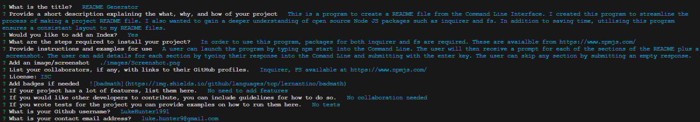

# README Generator

Video Link - https://www.loom.com/share/7ebc4a89059c4c5897411cd2a6fc6445

 ## Description
 This is a program to create a README file from the Command Line Interface. I created this program to streamline the process of making a project README file. I also wanted to gain a deeper understanding of open source Node JS packages such as inquirer and fs. In addition to saving time, utilising this program ensures a consistant layout to my README files.

- [Installation](#installation)

- [Usage](#usage)

- [Badges](#badges)

- [License](#license)

- [Features](#features)

- [Contribute](#contribute)
## License 
 This software is licensed under the MIT license.

## Installation
In order to use this program, packages for both inquirer and fs are required. These are avaialble from https://www.npmjs.com/

## Badges

## Usage
A user can launch the program by typing npm start into the Command Line. The user will then receive a prompt for each of the sections of the README plus a screenshot. The user can add details for each section by tyoing their response into the Comand Line and submitting with the enter key. The user can skip any section by submitting an empty response.

 
## Contribute
Please feel free to reach out if you would like to discuss collaboration.

## Features
Creates a README file from the CLI. If a license is selected, a badge is added to the top of the page under the title. This badge acts as a link to the details of the licensing agreement.

## Questions
 For any questions relating to this software, I can be contacted on github at https://github.com/LukeHunter1991 or via email at luke.hunter9@gmail.com

